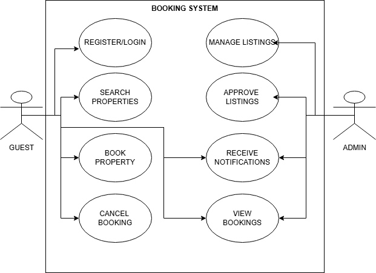

# Requirement Analysis in Software Development

## Introduction

This repository contains a structured breakdown of the **Requirement Analysis** phase within the Software Development Life Cycle (SDLC). It is part of the ALX ProDev Frontend program and simulates a real-world software planning scenario for a **Booking Management System**.

The purpose of this repository is to document, analyze, and visualize the system requirements to lay a solid foundation for future development. By completing this project, I will apply industry-standard practices and improve my ability to define and communicate functional needs clearly.

## What is Requirement Analysis?

**Requirement Analysis** is a crucial phase in the Software Development Life Cycle (SDLC) where the needs and expectations of stakeholders are gathered, analyzed, and documented. It serves as the blueprint for designing, building, and validating a software product that solves real problems and meets user expectations.

During this process, the development team works closely with stakeholders to understand what the system should do (functional requirements) and how it should perform (non-functional requirements). These requirements are captured using various techniques and documented to guide the project throughout its lifecycle.

---

## Why is Requirement Analysis Important?

Requirement Analysis plays a critical role in the success of a software project. Its importance includes:

1. **Clarity and Understanding**
   - It eliminates ambiguity by ensuring that both technical and non-technical stakeholders have a shared understanding of what is to be built.

2. **Scope Definition**
   - Clearly defines the project boundaries to prevent scope creep and keep the development focused on intended features.

3. **Improved Planning and Estimation**
   - Helps in estimating time, cost, and resources accurately, which leads to better project planning and execution.

4. **Foundation for Design and Development**
   - Acts as the basis for architectural and design decisions throughout the software development lifecycle.

5. **Quality Assurance**
   - Defines acceptance criteria and expected outcomes, allowing for effective validation and testing to ensure stakeholder satisfaction.

---

## Key Activities in Requirement Analysis

Requirement Analysis involves several core activities to ensure the software is built to meet user and business needs:

- **Requirement Gathering**
  - Conduct interviews, surveys, workshops, and observe users to collect initial requirements from stakeholders.

- **Requirement Elicitation**
  - Refine and expand on gathered requirements using brainstorming, prototyping, and focus groups to understand real needs.

- **Requirement Documentation**
  - Record the requirements in structured formats like Software Requirement Specification (SRS), user stories, and use case diagrams.

- **Requirement Analysis and Modeling**
  - Analyze, prioritize, and model requirements using tools like ER diagrams or data flow diagrams to assess feasibility and relationships.

- **Requirement Validation**
  - Review documented requirements with stakeholders to ensure they are complete, feasible, and aligned with business goals. Define acceptance criteria for future validation.

---

## Types of Requirements

In software engineering, requirements are categorized into two main types: **Functional** and **Non-functional**.

### Functional Requirements

Functional requirements describe **what the system should do**. They define specific behaviors, features, and interactions the system must support.

**Examples for Booking Management System:**

- **User Authentication:** Users must be able to sign up, log in, and log out securely.
- **Property Search:** Users should be able to search for available properties by location, price, and availability.
- **Booking System:** Users should be able to book a property, view their bookings, and cancel if needed.
- **Property Listings:** Admin or hosts should be able to add, edit, or delete property listings.
- **Payment Integration:** The system should allow users to make secure payments for bookings.

### Non-functional Requirements

Non-functional requirements describe **how the system should perform** rather than specific features. They address qualities like performance, security, and scalability.

**Examples for Booking Management System:**

- **Performance:** Pages must load in under 2 seconds even during peak usage.
- **Security:** All user data should be encrypted and protected against threats like SQL injection and XSS.
- **Scalability:** The system must support 1000+ concurrent users with minimal downtime.
- **Usability:** The interface should be intuitive and accessible to all user types.
- **Reliability:** The application should maintain 99.9% uptime and have automatic backup and recovery mechanisms.

## Use Case Diagrams

**Use Case Diagrams** are a type of behavioral diagram in the Unified Modeling Language (UML) used to visually represent the functional requirements of a system. They show how different actors (users or external systems) interact with the system through various use cases (tasks or functions).

### Benefits of Use Case Diagrams:
- **Clear Communication:** Helps both technical and non-technical stakeholders understand the system's functionality.
- **Requirement Validation:** Makes it easier to confirm whether all necessary features are captured.
- **Scope Definition:** Visually defines the scope of the system by showing what is inside and outside its boundaries.

### Use Case Diagram for the Booking System

